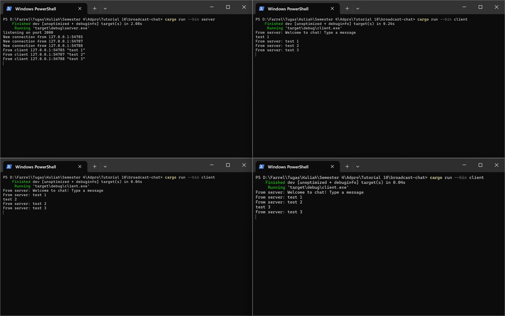
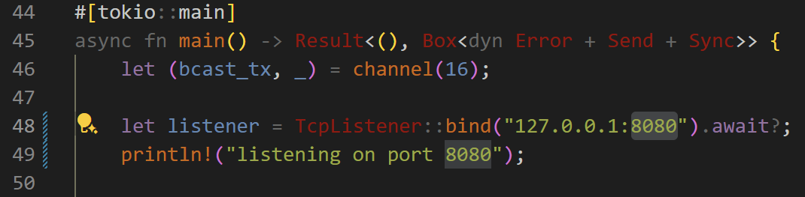
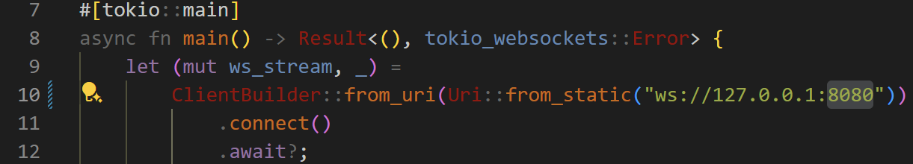

# Modul 10 - Broadcast Chat
**Samuel Farrel Bagasputra - 2206826614 - Adpro C**
  

## Experiment 2.1: Original code, and how it run

**Explanation** - Ketika saya mencoba untuk menjalankan 1 server & 3 client dan menuliskan pesan pada tiap client maka pesan yang saya tulis akan dikirimkan ke server dan server akan mengirimkan pesan tersebut ke semua client. Yang ditampilkan oleh tiap client dan server tersebut dapat dilihat pada gambar diatas.  

## Experiment 2.2: Modyfing port
Modifikasi port perlu dilakukan pada 2 bagian yaitu:
- Pada bagian `main` pada `server.rs`
     

- Pada bagian `main` pada `client.rs`
     

**Explanation** - Kedua bagian ini harus sama-sama diubah agar client dan server dapat berkomunikasi melalui port yang sama. Jika port pada client dan server tidak sama, maka client tidak akan dapat terhubung ke server. Pada kedua file, host untuk berkomunikasi defined pada bagian main function, tetapi untuk `server.rs` tidak terlihat menggunakan protocol Websocket karena tidak terdapat `ws://` pada bagian awal url pada listener. Selain itu, server juga menggunakan `TcpListener` yang berarti protokol yang digunakan adalah TCP.  